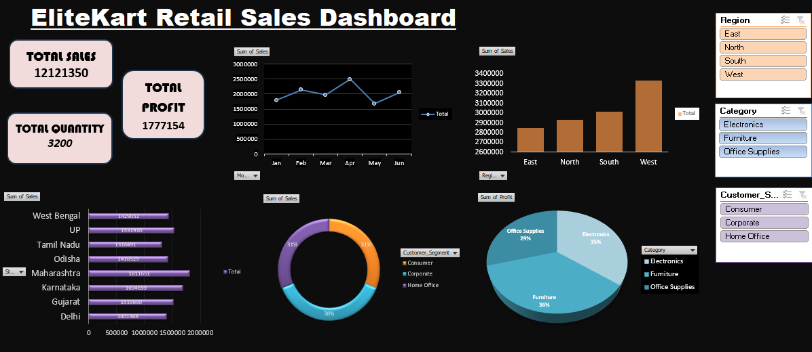

# EliteKart Retail Sales Dashboard

## Project Overview
The **EliteKart Retail Sales Dashboard** is an interactive Excel-based business intelligence project designed to analyze and visualize retail sales performance.  
This dashboard provides meaningful insights into sales, profit, quantity sold, customer segments, product categories, and regional performance using dynamic charts, KPIs, slicers, and pivot tables.

The project helps businesses make data-driven decisions by transforming raw sales data into an easy-to-understand visual reporting system.

---

## Dashboard Preview



---

## Features
- Interactive Excel Dashboard
- Dynamic KPI Cards
- Region-wise Sales Analysis
- Category-wise Profit Distribution
- Customer Segment Analysis
- Monthly Sales Trend Visualization
- State-wise Sales Performance
- Slicers for Easy Filtering
- Pivot Tables & Pivot Charts

---

## Key Metrics
- **Total Sales**
- **Total Profit**
- **Total Quantity Sold**
- **Monthly Revenue Trends**
- **Regional Sales Performance**
- **Category Contribution**
- **Customer Segment Insights**

---

## Tools & Technologies Used
- Microsoft Excel
- Pivot Tables
- Pivot Charts
- Slicers
- Conditional Formatting
- Data Cleaning
- Data Visualization

---

## Dataset Information
The dataset contains retail sales transaction details including:
- Sales
- Profit
- Quantity
- Region
- State
- Category
- Customer Segment
- Monthly Sales Data

---

## Business Insights
- Identified top-performing regions based on sales.
- Analyzed customer segments contributing maximum revenue.
- Compared category-wise profit distribution.
- Evaluated monthly sales trends for better forecasting.
- Tracked state-wise performance to identify growth opportunities.

---

## Project Objectives
- Convert raw retail data into actionable insights.
- Build an interactive dashboard for business reporting.
- Improve decision-making using visual analytics.
- Practice Excel data analysis and dashboard development skills.

---

## Folder Structure

```text
EliteKart-Retail-Sales-Dashboard/
│
├── Excel_Dashboard.xlsx
├── README.md
├── images/
│   └── dashboard.png
└── dataset/
    └── sales_data.xlsx
